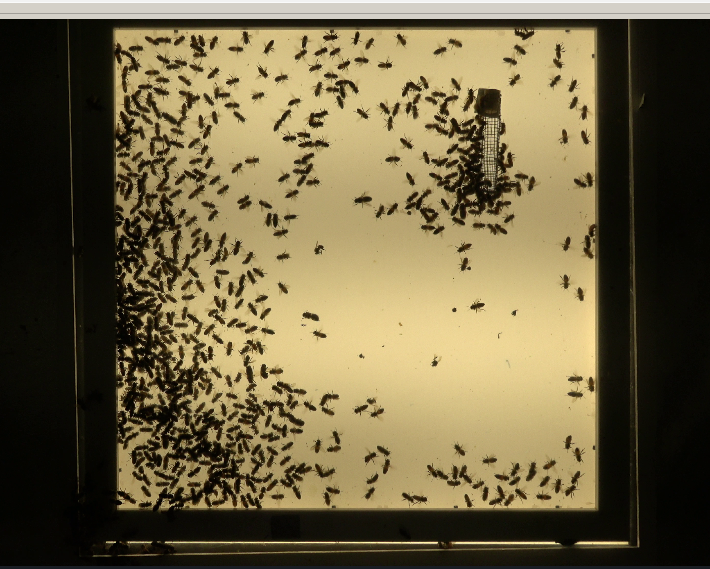
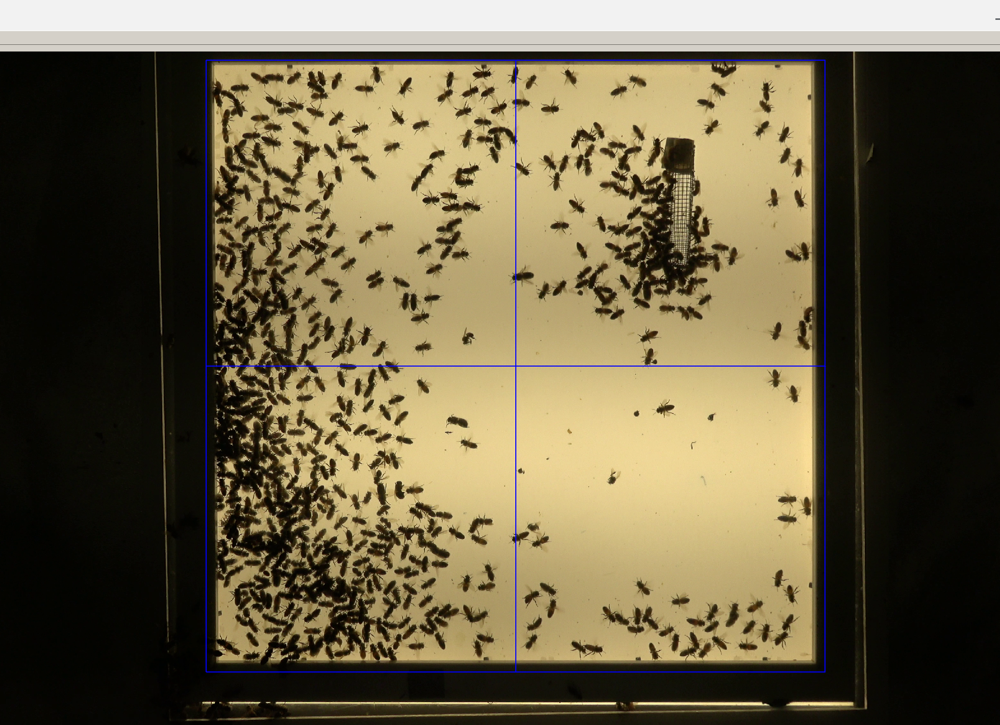
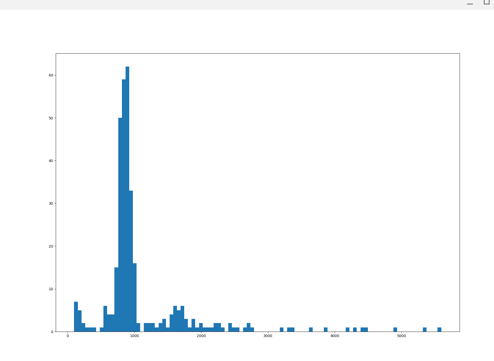
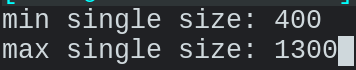
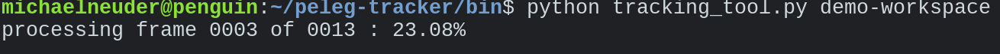
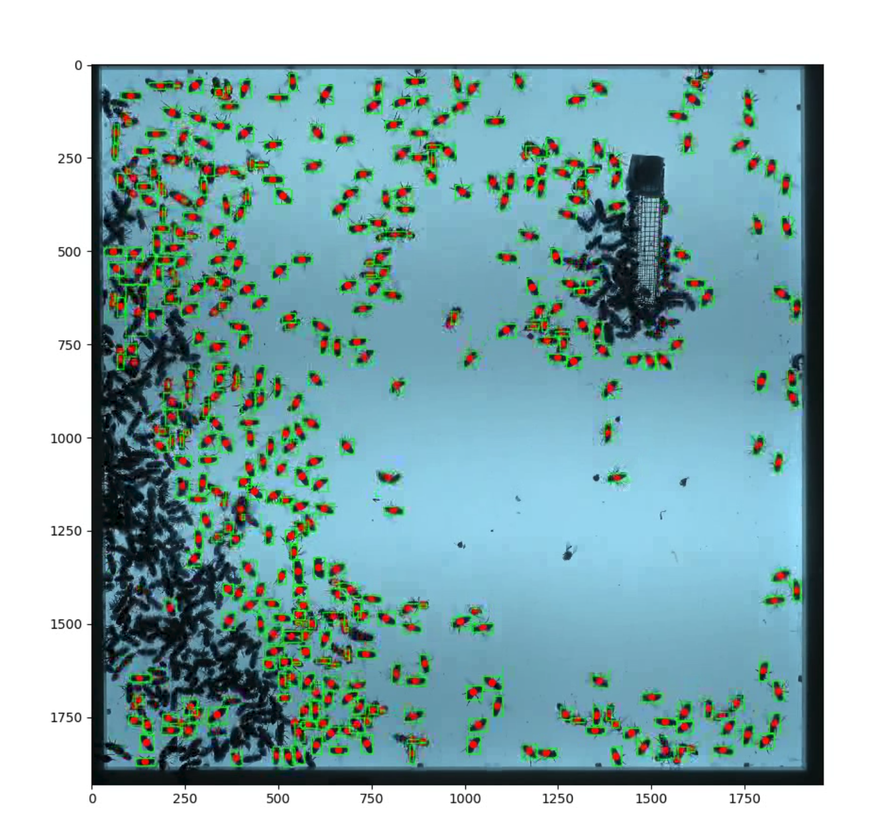

# peleg-tracker 

a command line interface to interact with bee tracking software written in support of the research conducted in Peleg Lab at the University of Colorado, Boulder. 

## 

### dependencies 

this code was written in python3 and depends on the following standard python packages.

> opencv2, matplotlib, skimage, numpy 

instructions for installing python3 [here](https://realpython.com/installing-python/) and pip [here](https://pip.pypa.io/en/stable/installing/).

once python3 and pip are installed run the following command from the command line.

```
pip install opencv-python matplotlib scikit-image numpy
```

if this runs with no errors you are ready to go!

##

### usage

this object you will be interacting with is a workspace. each workspace must have a unique name and a number of files will be automatically generated. this is to help keep different configurations and tracking instances seperate. when this repository is first cloned their will be a directory named workspaces with a single file in it

```
peleg-tracker
│   README.md
│   LICENSE
|   .gitignore
| 
└─── workspaces 
│   │   __init__.py
│   
└─── data 
│   │   dense_short.mp4
|
└─── bin
    │   ...
```

Now lets create our first tracking instance. There is a demo video called "dense_short.mp4" in the data directory that we will use to demonstrate tracking. The workflow is divided into 3 parts. 

#### 1. initializing workspace.

first we want to create our workspace and set the configuration for the tracking tool to use. we can do by running the following command from the peleg-tracker/bin directory (it is very important that it is run from this directory!).

```
python initialize_workspace.py {path to file} {workspace name}
```

For this demo that command will look like.

```
python initialize_workspace.py ../data/dense_short.mp4 demo-workspace
```

this will run with a lot of output and then the following window should open on your screen.


 
 now we want to choose the region of interest that we want the tracking algorithms to look at. to do this simply click and drag a box over the region. the following image shows an example region.
 
 
 
 now simply press enter when you are satisfied (you can always redraw the box if the first one wasn't ideal). next a histogram will appear on your screen. it should look like this. 
 
 
 
 this is showing the distribution of sizes of blobs that it detects in a single frame. we want to specify approximate range of sizes for the sinlge bees, which should look like a large spike in the histogram. we choose an lower and upper bound that approximately capture the large spike, say for example 400-1300. close the histogram and enter the lower and upper bounds in the command line. it should look something like this.
 
 
 
 once this is entered we are done! now if we look in our workspaces directory we can see that some files have been created. it should look like this. 
 
 ```
peleg-tracker
│   README.md
│   LICENSE
|   .gitignore
| 
└─── workspaces 
│   │   __init__.py
|   |
|   └─── demo-workspace
|        |    config.json
|        |    cropped_video.mp4
|        |    object_sizes.png
│   
└─── data 
│   │   dense_short.mp4
|
└─── bin
    │   ...
```

the config.json file simply keeps track of all the data we just input to initialize the workspace. this will be used by the tracking tool. the cropped_video.mp4 file is the same video we gave as input initially, but cropped to the dimensions we specified. the object_sizes.png image is the histogram of sizes. this will be helpful if we want to adjust the size of single bees in the config file. 

#### 2. tracking tool.

now that the workspace is created, most of our work is done. to run the processing we first need to extract the bee locations from each frame. that is what this step does. again from the bin directory (and only the bin directory!) run the following.

```
python tracking_tool.py {workspace name}
```

so in the case of this demo that is, 

```
python tracking_tool.py demo-workspace
```

this will start off the processing of the video. it usually takes a couple seconds per frame, so if it is a super long video this could be awhile. it has some progress information along the bottom and should look something like this.



the frame counter is usually a couple off but it should at least help get an idea of how long it will take to run. now if we look in our workspaces directory we see more files were added. it should look like this.

 ```
peleg-tracker
│   README.md
│   LICENSE
|   .gitignore
| 
└─── workspaces 
│   │   __init__.py
|   |
|   └─── demo-workspace
|        |    config.json
|        |    cropped_video.mp4
|        |    object_sizes.png
│        |
|        └─── frame_data
|             |    frame0.pkl
|             |    frame1.pkl
|             |    ...
│   
└─── data 
│   │   dense_short.mp4
|
└─── bin
    │   ...
```

#### 3. create tracked video.

now that we have all the data we need we can finally create our marked video. this command handes the creation of the marked video and frames.

```
python create_tracked_video.py {workspace name}
```

so in the case of this demo that is, 

```
python create_tracked_video.py demo-workspace
```

this will again bring up the same progress data. this is usually about a second per frame so again may be a long wait if you are working with a long video. now the file structure should look as follows.

 ```
peleg-tracker
│   README.md
│   LICENSE
|   .gitignore
| 
└─── workspaces 
│   │   __init__.py
|   |
|   └─── demo-workspace
|        |    config.json
|        |    cropped_video.mp4
|        |    object_sizes.png
|        |    marked_video.mp4
│        |
|        └─── frame_data
|             |    frame0.pkl
|             |    frame1.pkl
|             |    ...
│
|        └─── frame_data
|             |    frame0000.png
|             |    frame0001.png
|             |    ...
│   
└─── data 
│   │   dense_short.mp4
|
└─── bin
    │   ...
```

the "marked_video.mp4" file that appears is the output that we built. a video with all detected bees boxed and marked. the video should look something like this.



## 

alright! thats it. you can edit the configuration file at any time if you want to tweak bee sizes or whatever. once a workspace is built it should be pretty self contained and useful for trying different experiments and configurations.

happy tracking!
mike
